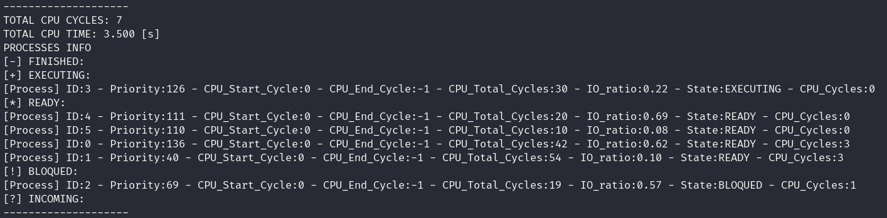
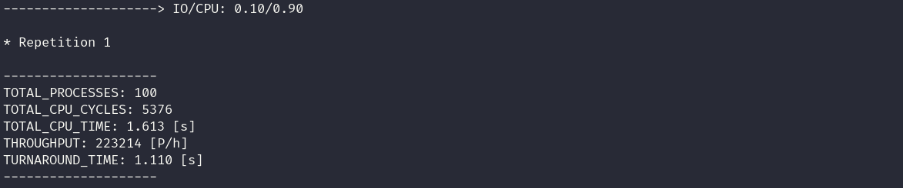

# OS-Scheduler-Simulator

Scheduler simulator with the following components:
* Processes (IO/CPU bound)
* Scheduling Algorithms (Priority/RoundRobin/ShortestJob)
* Virtual CPU time
* Interruptions
* Context Switching

The simulator has two modes: interactive and benchmark

# Compilation

Run the [compile.sh](./compile.sh) script to compile all three versions of the simulator

```
bash ./compile.sh
```

# Execution

The executable files are:
```
./out/priority_scheduling_simulator

./out/round_robin_scheduling_simulator

./out/shortes_job_scheduling_simulator
```

Simulation modes supported via cmd arguments.

## Interactive Mode

Run the executable with the -i flag
```
./out/<scheduling_algorithm>_scheduling_simulator -i
```



## Benchmark Mode

Run the executable with the -b flag
```
./out/<scheduling_algorithm>_scheduling_simulator -b
```
The benchmark mode compares the turn around time and throughput of the simulator at different ratios of CPU/IO bound processes.



...

## User Mode

Run the executable with the -u flag
```
./out/<scheduling_algorithm>_scheduling_simulator -u
```

Receives process information:
* Priority
* CPU_Start_Cycle
* CPU_Total_Cycles
* IO_ratio

Some input examples for the user mode are as follows:

Without IO

```
5
2 0 9 0
4 0 7 0
4 0 5 0
1 2 6 0
3 5 3 0
```

With IO

```
5
2 0 9 0.5 
4 0 7 0.3 
4 0 5 0.2 
3 2 6 0.1 
1 5 3 0.2 
```
